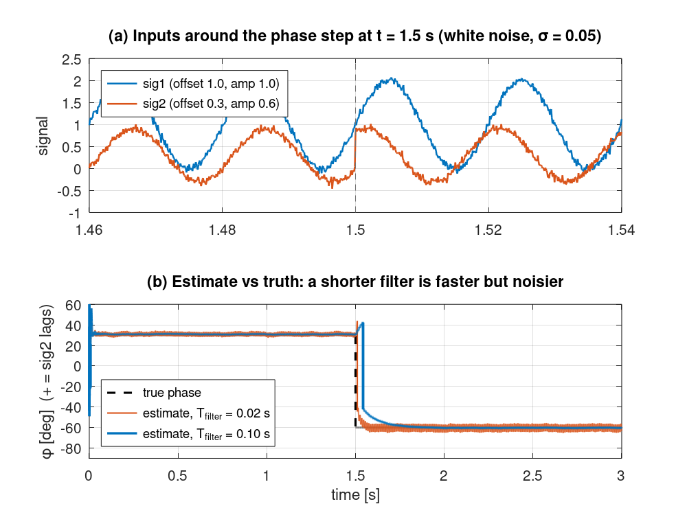
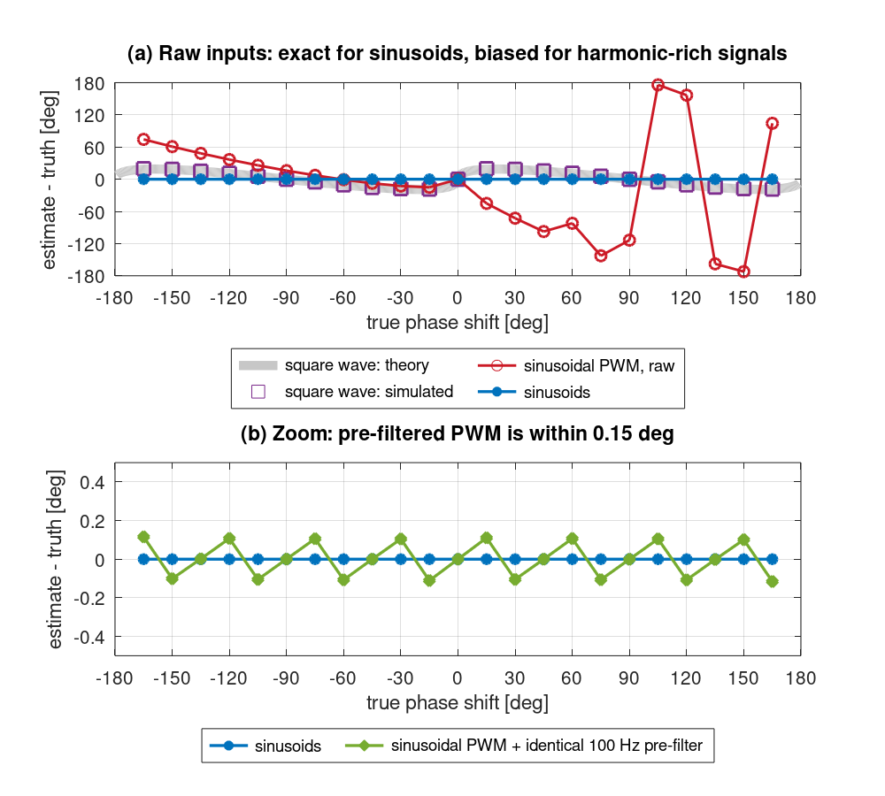
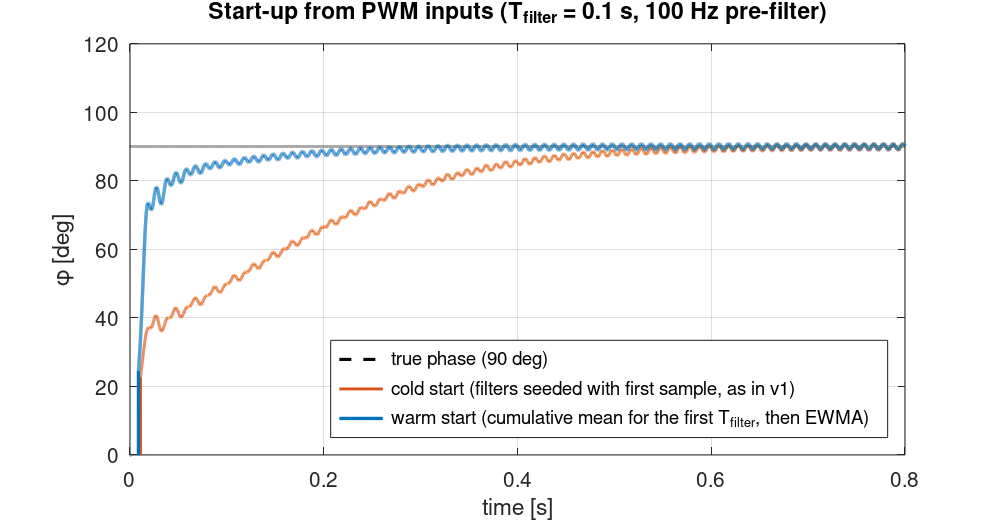

# Phase Shift Estimator (MATLAB / Octave)

A real-time, sample-by-sample estimator of the phase shift between two periodic signals, using the **correlation method**. It handles DC offsets, unequal amplitudes and noise; with an identical pre-filter on both inputs, it also handles PWM.



---

## Problem

Converter controllers often need the phase between two measured waveforms: grid voltage vs current, or a reference vs a converter output. The waveforms arrive one sample at a time, sit on DC offsets, have different amplitudes, and may be PWM rather than clean sinusoids. A useful estimator must:

- be cheap enough to run inside the control loop,
- not need the signal frequency in advance,
- say whether the second signal **leads or lags**, not only by how much.

## Method

Every average below is a first-order IIR low-pass filter, which is the same thing as an exponentially weighted moving average (EWMA):

$$\bar{x}_k = (1-a)\,\bar{x}_{k-1} + a\,x_k, \qquad a = \frac{\Delta t}{T_\text{filter} + \Delta t}$$

1. **DC removal.** $\tilde{s}_i = s_i - \overline{s_i}$.
2. **Normalised correlation.** For two sinusoids, the correlation coefficient equals the cosine of the phase shift:

$$\cos\varphi = \frac{\overline{\tilde{s}_1 \tilde{s}_2}}{\sqrt{\overline{\tilde{s}_1^2}}\,\sqrt{\overline{\tilde{s}_2^2}}}, \qquad |\varphi| = \arccos(\cos\varphi)$$

3. **Lead/lag sign.** $\overline{\dot{\tilde{s}}_1\,\tilde{s}_2} \propto -\sin\varphi$, so its sign says whether $s_2$ leads (negative) or lags (positive).

**Optional pre-filter (added in v2).** The same 2nd-order low-pass is applied to both inputs. Identical filters shift both signals by the same phase, so the phase difference is unchanged, but switching harmonics are removed before they can bias the correlation.

**Warm/Soft start (added in v2).** For the first $T_\text{filter}$ the weight is $a_k = \max(a, 1/k)$: a plain cumulative mean that then hands over to the EWMA. This removes the inrush/start-up transient caused by seeding the filters with a single sample.

> Step 2 is similar to how EWMA correlation is estimated in finance (the RiskMetrics approach). $T_\text{filter}$ plays the role of the decay factor, $\lambda = 1 - a$. My `ewma-correlation` repo applies the exact same estimator to stock and bond returns.

## Results

| Input waveform (settled, true phase −165° … +165°) | Max error |
|---|---|
| Sinusoids with different offsets and amplitudes | **0.00°** |
| Two-level sinusoidal PWM, 2 kHz carrier, **+ identical 100 Hz pre-filter** | **0.12°** |
| 50 % square waves | 19.5° (matches theory, see below) |
| Two-level sinusoidal PWM, **raw** | unusable: +60° reads as −22.1°, +90° as −23.6° |



- **Speed vs noise (figure at top).** A phase step from +30° to −60° with noise σ = 0.05: with $T_\text{filter}$ = 0.02 s the cycle average settles within 1° in 0.079 s, but the steady-state standard deviation is 2.77°. With $T_\text{filter}$ = 0.1 s it takes 0.334 s, but the standard deviation is 0.57°.
- **Start-up.** Starting from PWM inputs, the warm start is within 0.76° after 0.3 s. The v1 cold start is still 12.3° off at that point.



## Validation

- **Theory vs simulation.** For 50 % square waves, the correlation coefficient is $1 - 2|\varphi|/\pi$ (a triangle, not a cosine), so the method *should* read 60.0° for a true 45°. The simulation reads 60.4°, and the full simulated curve sits on the theory curve (top panel of figure 2).
- **Refactor safety.** `tests/test_legacy_wrapper.m` runs the published v1 code (kept verbatim in `tests/reference/`) and the new `Ph_Sft_Corr_Mtd` side by side. They agree to 1e-12° on every sample.
- **Fast path = real-time path.** `pse_batch` (vectorised with `filter`) matches the sample-by-sample `pse_step` loop to within 1e-6°, with and without the pre-filter and warm start.
- **Unit tests (8)** cover accuracy, the sign convention, independent instances, PWM with and without the pre-filter, the warm start and input checks. They run on every push via GitHub Actions (GNU Octave).

## Limitations

- **Harmonic-rich inputs need the pre-filter.** In v1 I described the estimator as working with PWM signals. Testing it properly showed that raw two-level PWM biases the magnitude and makes the lead/lag sign sort of unreliable, because the switching harmonics (depending on various factosr) dominate both correlations. Use `prefilter_hz` ≈ 2× the fundamental. For 50 Hz PWM with modulation index 0.4, the worst settled error was 0.20° at 100 Hz, 1.04° at 250 Hz and 9.09° at 500 Hz.
- **One frequency.** The method assumes both signals share one fundamental. Inputs with several frequencies need band-pass pre-filtering.
- **Near 0° and ±180°** the arccos is ill-conditioned: small biases in the correlation become larger angle errors. Near ±180° the lead/lag sign also becomes very noise-sensitive.
- **Fixed sample rate.** The derivative in the sign test uses the nominal `dt`.
- **Possible next step:** a quadrature (I/Q) version that tracks the frequency with a PLL. That would give phase directly from `atan2`, without the arccos conditioning problem.

## How to run

Requires MATLAB R2019b+ **or** GNU Octave 8+. No toolboxes.

```matlab
addpath src

% Real-time use: one call per sample (any number of independent estimators)
est = pse_init(1e-4, 0.1);            % dt = 100 us, T_filter = 0.1 s
% est = pse_init(1e-5, 0.1, 100);     % ...with a 100 Hz pre-filter for PWM
[phi_deg, est] = pse_step(est, sig1_sample, sig2_sample);

% Offline use on whole vectors (same result, much faster)
phi_deg = pse_batch(sig1, sig2, dt, T_filter, prefilter_hz);

% v1 API still works unchanged
phi_deg = Ph_Sft_Corr_Mtd(sig1_sample, sig2_sample);
```

```matlab
run('examples/demo_basic.m')     % minimal loop example
run('examples/make_figures.m')   % regenerates every figure and number above
cd tests; run_tests              % 8 tests
```

| Function | Purpose |
|---|---|
| `pse_init(dt, T_filter, prefilter_hz)` | Create one estimator state |
| `pse_step(state, s1, s2)` | One-sample update (real-time use) |
| `pse_run(sig1, sig2, ...)` | Loop `pse_step` over whole vectors |
| `pse_batch(sig1, sig2, ...)` | Vectorised equivalent of `pse_run` |
| `Ph_Sft_Corr_Mtd(s1, s2)` | Original v1 API (single instance, fixed `dt` = 1e-4, `T_filter` = 0.1) |

| Parameter | Typical value | Effect |
|---|---|---|
| `dt` | your loop period | Must match the actual sample rate |
| `T_filter` | 2–10 fundamental periods | Larger = smoother, slower |
| `prefilter_hz` | 0 (off), or ≈ 2 × fundamental for PWM | Removes switching harmonics |

## Changes from v1

- State moved from `persistent` variables into a struct, so several estimators can run at once.
- `dt` and `T_filter` are now arguments instead of being hard-coded.
- Added the optional identical pre-filter, the warm start and the vectorised `pse_batch`.
- Added tests, figures and an honest accuracy table. The v1 claim about PWM inputs is corrected above.

## Context

A personal project. I initially wrote it as a Simulink utility for power-converter simulations to visually see (in a numerical form) the phase between each phase to ensure symmetric values and rewrote it in this cleaner, tested form as part of logging my work. Solo work.

## License

MIT, see [LICENSE](LICENSE).
